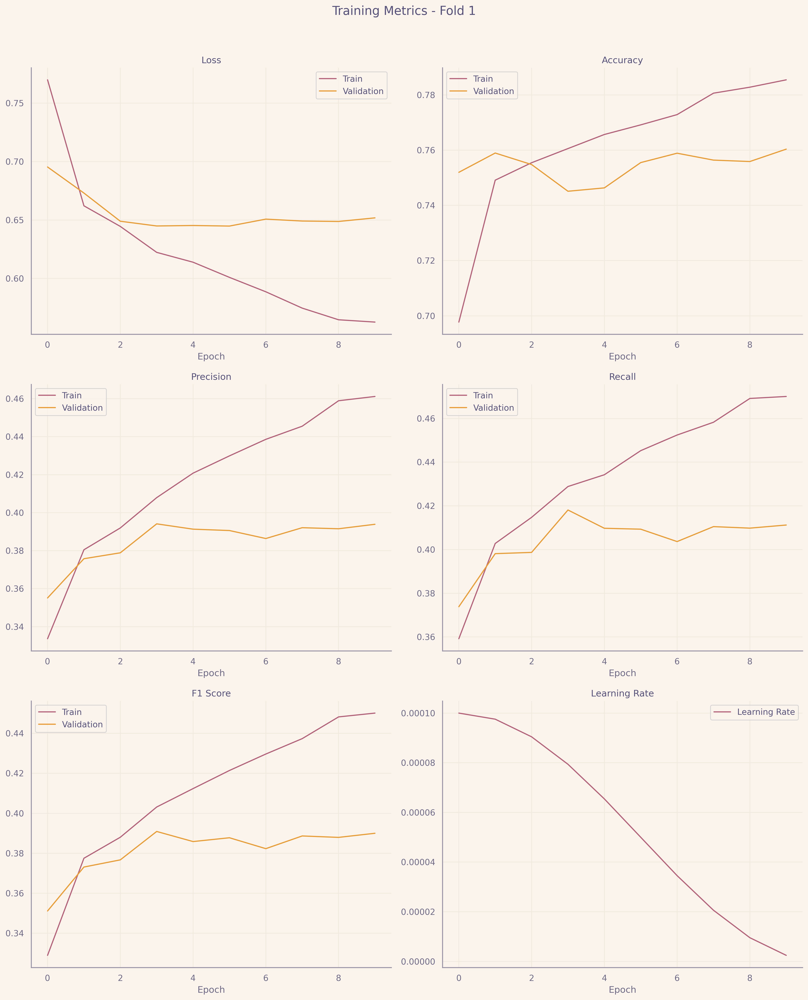
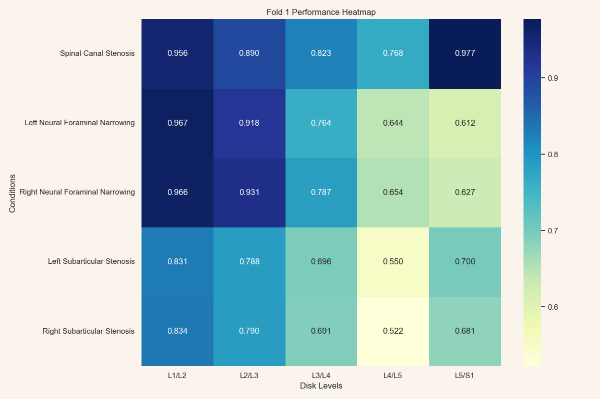

# RSNA 2024 Lumbar Spine Degenerative Classification

## Overview
This competion is part of my final project for graduating B.S in Computer Scince in the The Open University Of Israel.

The object of the project is to take a dataset and explore it gain insghist and on top of that insghits to build a model, I extacivley explore the data to gain as much insghits as I can then move to build a models. 

[Competition Main Page](https://www.kaggle.com/competitions/rsna-2024-lumbar-spine-degenerative-classification/overview)

[Competition Data Page](https://www.kaggle.com/competitions/rsna-2024-lumbar-spine-degenerative-classification/data)

[Project Notebook](Project.ipynb)

[License](LICENSE)
## Model

## Model Results 

Training metrics fold 1

Let's dive in! 🤿

